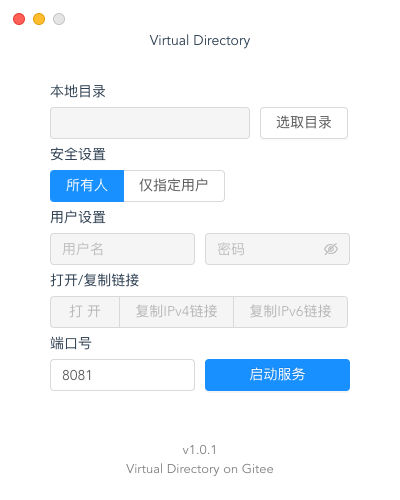

# Virtual Directory

## 经过测试的系统
-  macOS 13.4
-  Windows 11

## 注意区分和另一个库`File Sharer`的区别


||Virtual Directory|File Sharer|
|-|-|-|
语言|JavaScript和Vue|Dart
框架|Electron|Flutter
文件体积|较大|较小
IPv6|支持|不支持
支持系统|Windows<br/>macOS<br/>Linux|macOS<br/>Windows（未经过测试）<br>Linux（未经过测试）

## 效果图



## 目前最新版本
v1.0.2 (2023/7/6)

## 更新日志
- ### v1.0 (2023/7/5)
  - 第一个版本

- ### v1.0.1 (2023/7/5)
  - 增加图标
  - 改进Windows界面
  - 对IPv6不支持的情况做提示
  - 启动失败提示

- ### v1.0.2 (2023/7/6)
  - 解决下载文件名乱码的问题
  - 解决下载文件时无法获取文件大小和剩余时间的问题
  - 增加记住上一次输入的功能

- ### v1.0.3 (开发中)
  - 避免Windows用户选中系统文件夹

## 关于代码
使用Electron和Vue2开发，使用到的库：

- Ant design (UI库)
- Element UI (UI库)
- base-64 (登录授权加密)

## 一些注意事项
- 文件页面中有一些元素是从互联网上加载的（使用`Element UI`中的图标），因此如果访问局域网的设备没有连接到互联网，可能会导致无法加载页面中的文件夹或者文件图标，但是并不影响使用
- 如果你需要在公网中访问，**不要设置常用的端口号**，例如`8080`，`80`等，可能会导致无法访问
- 如果你需要在公网中访问，确保你的互联网环境支持在公网中访问，一般来说需要支持IPv6的网络
- 如果你需要在公网中访问，一些路由器或者你的电脑会使用防火墙拦截，**不要完全开放防火墙**，务必确保连接的安全性

## 关于配置
如果你希望在自己的电脑中配置该项目，以下为操作步骤：

1. 安装`node`，推荐版本为`node@14.18`
2. 使用命令行进入到项目文件夹
3. 输入命令：
   ```bash
   npm install
   ```
   如果你更喜欢使用`yarn`，首先确保你已经安装了`yarn`，然后在命令行中输入：
   ```bash
   yarn install
   ```
4. 接着输入命令来运行(`serve`)或生成(`build`)：
   ```bash
   npm run electron:serve
   npm run electron:build
   ```
   或者`yarn`：
   ```bash
   yarn run electron:serve
   yarn run electron:build
   ```