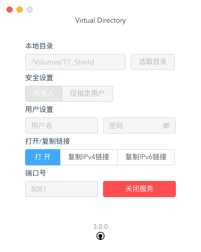
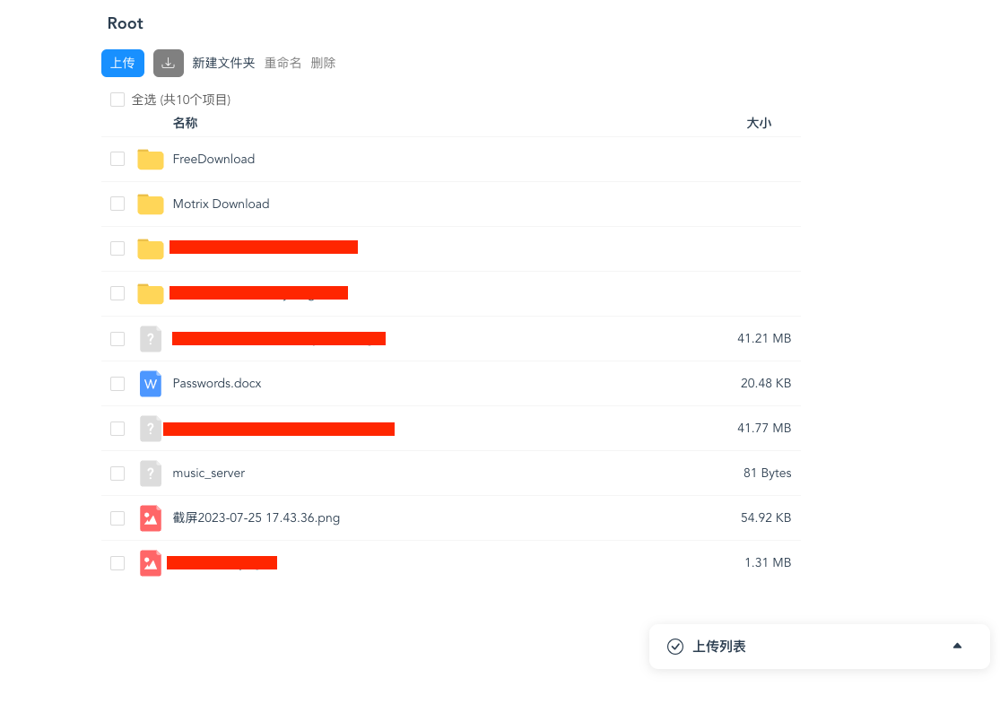

# Virtual Directory


注意这个项目由两部分组成

使用Vue开发的前端页面[在这里](https://github.com/Zhoucheng133/virtual-dir-page)

## 经过测试的系统
-  macOS 13.4
-  Windows 11

## 效果图

### 服务端：



### 客户端：



### 视频预览


## 使用说明

- 一般步骤：
  1. 打开软件选择需要分享的目录，**注意Windows系统不要选择磁盘的根目录**
  2. 选择是否要添加访问权限，即需要登录之后才能进行访问和操作，**如果你需要在公网中访问务必选择此项**
  3. （如果选择了需要账户密码登录使用）设定用户名和密码
  4. 输入合适的端口号，默认为`8081`，**注意不是所有的端口号都能使用**
  5. 点击`启动服务`
  6. 在局域网内可以通过`IPv4`地址访问到虚拟目录网站，如果你开通了公网服务，在防火墙允许的情况下也可以在公网中通过`IPv6`地址访问到

- **注意没有互联网连接时，在打开页面时可能出现问题**

## 目前最新版本
v3.2.1

## 更新日志
- ### v3.2.2 (2023/12/15)
  - 大幅提高网格视图下预览图片的效率
  - 修复无法下载单个文件夹的问题

- ### v3.2.1 (2023/12/14)
  - 添加网格视图
  - 添加文件夹/文件混合下载功能

- ### v3.2.0 (2023/12/3)
  - 添加了文件夹下载的功能
  - 修复上传文件的身份认证问题

- ### v3.1.1 (2023/12/1)
  - 更新身份验证策略
  - 修复页面切换问题
  - 修复含有特殊字符图片无法预览的问题

- ### v3.1.0 (2023/11/30)
  - 添加多文件下载
  - 添加显示已经上传的文件大小
  - 添加对m4a的支持
  - 改进标题栏和工具栏
  - 改进排序规则
  - 改进下载按钮
  - 修复上传失败后没有刷新页面的问题
  - 修复右键菜单删除文件的错误

- ### v3.0.0 (2023/11/26)
  - 使用Webpack重新开发了客户端页面
  - 改进图标的显示
  - 使用客户端页面登录
  - 添加查看上传进度功能
  - 右键菜单添加了下载按钮
  - 修复视频需要加载完成才能播放的问题
  - 修复多选时右键菜单识别错误

- ### v2.1.0 (2023/9/11)
  - 添加一些文件的预览功能
  - 对于不识别的文件直接下载

- ### v2.0.5 (2023/8/21)
  - 添加拖拽上传功能
  - 修复出错没有提示的bug

- ### v2.0.4 (2023/8/2)
  - 添加懒加载
  - 修复网格布局错误

- ### v2.0.3 (2023/7/28)
  - 超长文件名简写
  - 支持图片缩略图
  - 增加点击路径跳转
  - 增加文件显示方式
  - 调整页面布局

- ### v2.0.2 (2023/7/26)
  - 解决视频无法跳转进度条的问题
  - 新标签页打开文件
  - 修改程序逻辑

- ### v2.0.1 (2023/7/23)
  - 支持上传多个文件
  - ~~支持上传目录~~
  - 解决上传失败没有提示的bug
  - 添加全选按钮
  - 兼容Linux系统

- ### v2.0 (2023/7/21)
  - 增加上传文件的功能
  - 增加删除文件的功能
  - 增加重命名文件/文件夹功能
  - 修改样式表的一些bug
  - 添加右键菜单
  - 弹窗适配移动端

- ### v1.0.5 (2023/7/12)
  - 完善浏览器端界面
  - 浏览器端界面添加了很多文件图标

- ### v1.0.4 (2023/7/8)
  - 完善启动判定
  - 增加对Apple Silicon的支持

- ### v1.0.3 (2023/7/7)
  - 避免Windows用户选中系统文件夹
  - 避免macOS用户选中根目录
  - 解决重复调用函数的问题
  - 在macOS上点击红色按钮修改为退出（原先为关闭窗口）

- ### v1.0.2 (2023/7/6)
  - 解决下载文件名乱码的问题
  - 解决下载文件时无法获取文件大小和剩余时间的问题
  - 增加记住上一次输入的功能

- ### v1.0.1 (2023/7/5)
  - 增加图标
  - 改进Windows界面
  - 对IPv6不支持的情况做提示
  - 启动失败提示

- ### v1.0 (2023/7/5)
  - 第一个版本

## 关于配置
如果你希望在自己的电脑中配置该项目，以下为操作步骤：

1. 安装`node`，推荐版本为`node@16`
2. 安装`yarn`（推荐），输入命令来安装：
   ```bash
   npm install -g yarn
   ```
3. 使用命令行进入到项目文件夹
   ```bash
   # 注意根据实际情况
   cd virtual_directory
   ```
4. 输入命令：
   ```bash
   yarn install
   ```
5. 接着输入命令来运行(`serve`)或生成(`build`)：
   ```bash
   yarn run electron:serve
   yarn run electron:build
   ```