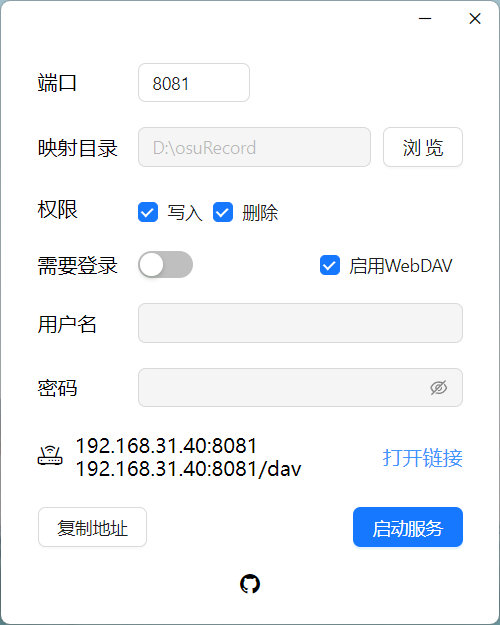

# Virtual Directory


UI网页端项目[在这里](https://github.com/Zhoucheng133/virtual-dir-page)

## 经过测试的系统
-  macOS 15
-  Windows 11

## 效果图

### 服务端：



### 客户端：


### 视频预览


## 使用说明

- 一般步骤：
  1. 打开软件选择需要分享的目录
  2. 选择是否要添加访问权限，即需要登录之后才能进行访问和操作
  3. （如果选择了需要账户密码登录使用）设定用户名和密码
  4. 输入合适的端口号，默认为`8081`，**注意不是所有的端口号都能使用**
  5. 点击`启动服务`
  6. 在局域网内可以通过`IPv4`地址访问到虚拟目录网站
  7. 注意，如果你希望在局域网内/公网中访问到页面，**务必保证没有被防火墙拦截**

- 使用WebDAV
  1. 访问的客户端需要有可以连接WebDAV的工具，例如iOS端的Documents或者安卓端的ES文件管理器等
  2. 勾选启用WebDAV服务，启动服务
  3. 在Documents或其他可以访问WebDAV服务的软件中连接到WebDAV即可，地址为`<ip地址>:<端口号>/dav`

## 常见问题

- 点击启动服务出现错误弹窗
  1. 端口不允许，很多端口已经被系统占用，因此你不能使用这些端口
  2. 分享了系统目录或者需要权限访问的目录，在Windows上这可能包括所有硬盘的根目录
- 在局域网内无法访问到页面
  - 很大概率是防火墙的问题，你可以先尝试在服务端机器上尝试是否可以正确打开，如果在服务端上可以正常打开，那你可能需要修改防火墙设置或者关闭防火墙，在Windows上在这里：`控制面板->所有控制面板项->Windows Defender 防火墙->允许的应用`，你需要手动将Virtual Directory添加到允许的应用
- 视频/图片/音频无法预览
  - 很大概率是编码问题，即便你使用第三方的播放器或者图片查看器可以正确打开，但是在网页端能够预览的编码格式有限

## 更新日志

### v4.0.3 (2024/12/24)
- 添加了对macOS系统的支持
- 修复一个问题

<details>
<summary>过往的版本</summary>

### v4.1.2 (2024/8/9)
- 添加播放器中文支持

### v4.1.1 (2024/7/30)
- 修复Windows图标显示问题

### v4.1.0 (2024/7/17)
- 添加了WebDAV功能
- 精简了一部分代码

### v4.0.6 (2024/7/13)
- 添加了分享路径合法性检查

### v4.0.5 (2024/7/9)
- 重构了下载逻辑

### v4.0.4 (2024/7/3)
- 修复无法下载单个文件的问题

### v4.0.3 (2024/6/5)
- 添加查看ip地址
- 修复了一些错别字
- 调整了一下界面

- ### v4.0.2 (2024/5/11)
  - 添加权限设置，包括读取，写入和删除的权限
  - ~~添加简易模式（只允许上传）~~
  
- ### v4.0.1 (2024/5/10)
  - (更新内容相较于v3.2.4)
  - 使用Vue3+Vite+Electron重构
  - 修复特殊字符问题
  - 修复页面语言识别问题
  - 修复无法拖拽上传的问题
  - 改进了运行效率
  - 改进了服务端界面布局

- ### v4.0.0 Beta (2024/5/8) 
  - 使用Vue3+Vite+Electron重构
  - 改进启动速度

- ### v3.2.4 (2023/12/30)
  - 修复在预览界面下载错误的问题

- ### v3.2.3 (2023/12/18)
  - 修复文件压缩完成才能下载的问题
  - 修复预览图片时客户端读写压力过大的问题

- ### v3.2.2 (2023/12/16)
  - 大幅提高网格视图下预览图片的效率
  - 修复无法下载单个文件夹的问题

- ### v3.2.1 (2023/12/14)
  - 添加网格视图
  - 添加文件夹/文件混合下载功能

- ### v3.2.0 (2023/12/3)
  - 添加了文件夹下载的功能
  - 修复上传文件的身份认证问题

- ### v3.1.1 (2023/12/1)
  - 更新身份验证策略
  - 修复页面切换问题
  - 修复含有特殊字符图片无法预览的问题

- ### v3.1.0 (2023/11/30)
  - 添加多文件下载
  - 添加显示已经上传的文件大小
  - 添加对m4a的支持
  - 改进标题栏和工具栏
  - 改进排序规则
  - 改进下载按钮
  - 修复上传失败后没有刷新页面的问题
  - 修复右键菜单删除文件的错误

- ### v3.0.0 (2023/11/26)
  - 使用Webpack重新开发了客户端页面
  - 改进图标的显示
  - 使用客户端页面登录
  - 添加查看上传进度功能
  - 右键菜单添加了下载按钮
  - 修复视频需要加载完成才能播放的问题
  - 修复多选时右键菜单识别错误

- ### v2.1.0 (2023/9/11)
  - 添加一些文件的预览功能
  - 对于不识别的文件直接下载

- ### v2.0.5 (2023/8/21)
  - 添加拖拽上传功能
  - 修复出错没有提示的bug

- ### v2.0.4 (2023/8/2)
  - 添加懒加载
  - 修复网格布局错误

- ### v2.0.3 (2023/7/28)
  - 超长文件名简写
  - 支持图片缩略图
  - 增加点击路径跳转
  - 增加文件显示方式
  - 调整页面布局

- ### v2.0.2 (2023/7/26)
  - 解决视频无法跳转进度条的问题
  - 新标签页打开文件
  - 修改程序逻辑

- ### v2.0.1 (2023/7/23)
  - 支持上传多个文件
  - ~~支持上传目录~~
  - 解决上传失败没有提示的bug
  - 添加全选按钮
  - 兼容Linux系统

- ### v2.0 (2023/7/21)
  - 增加上传文件的功能
  - 增加删除文件的功能
  - 增加重命名文件/文件夹功能
  - 修改样式表的一些bug
  - 添加右键菜单
  - 弹窗适配移动端

- ### v1.0.5 (2023/7/12)
  - 完善浏览器端界面
  - 浏览器端界面添加了很多文件图标

- ### v1.0.4 (2023/7/8)
  - 完善启动判定
  - 增加对Apple Silicon的支持

- ### v1.0.3 (2023/7/7)
  - 避免Windows用户选中系统文件夹
  - 避免macOS用户选中根目录
  - 解决重复调用函数的问题
  - 在macOS上点击红色按钮修改为退出（原先为关闭窗口）

- ### v1.0.2 (2023/7/6)
  - 解决下载文件名乱码的问题
  - 解决下载文件时无法获取文件大小和剩余时间的问题
  - 增加记住上一次输入的功能

- ### v1.0.1 (2023/7/5)
  - 增加图标
  - 改进Windows界面
  - 对IPv6不支持的情况做提示
  - 启动失败提示

- ### v1.0 (2023/7/5)
  - 第一个版本
</details>

## 关于配置
如果你希望在自己的电脑中配置该项目，以下为操作步骤：

你需要安装`Node.js`，至少需要`Node.js@18`，本人开发环境的版本是`Node.js@18.20.2`，并且安装了`yarn`包管理器

```bash
npm install yarn -g
```

通过下面的命令来安装所需要的依赖：
```bash
cd [本项目地址]
yarn install
```

如果你希望打包，可以使用下面的命令
```bash
yarn run build
# 如果是Windows系统
yarn run electron-builder --win
# 如果是macOS系统
yarn run electron-builder --mac
# 如果是Linux系统 (不确保可以正确地运行在Linux系统上)
yarn run electron-builder --linux
```
